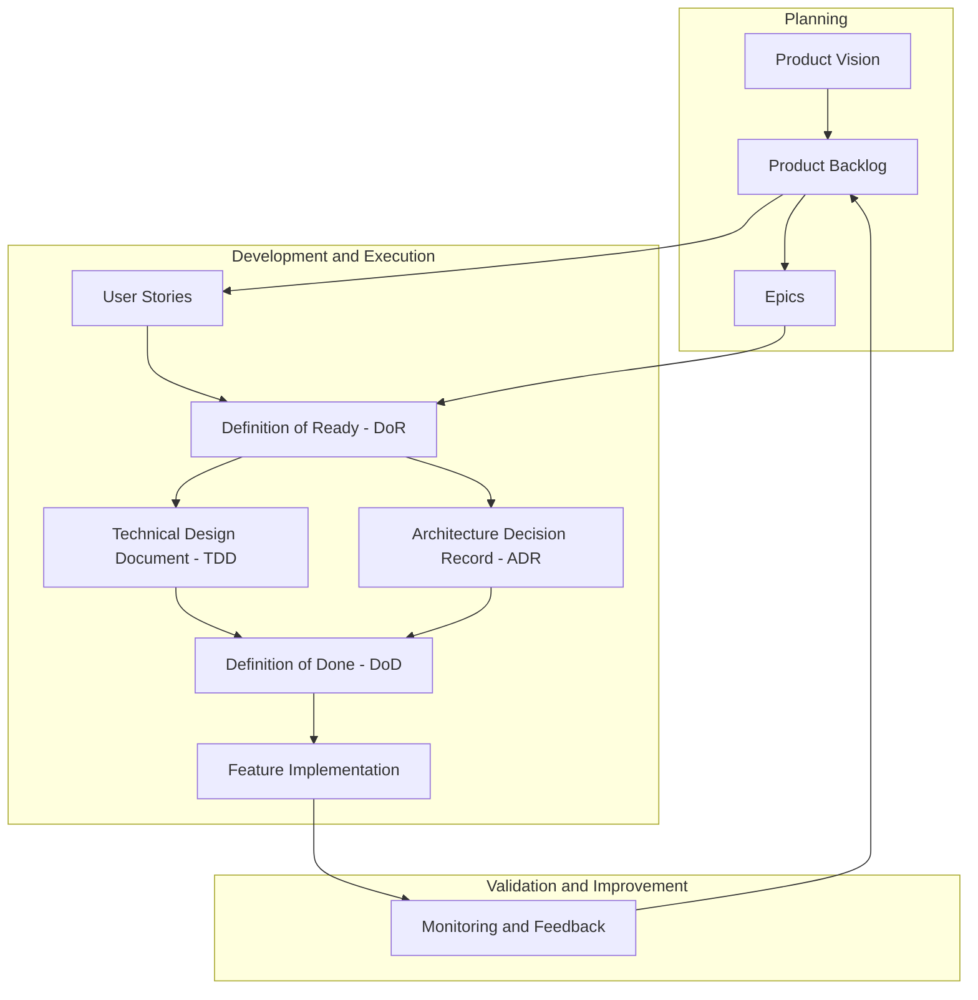

### Por onde começar um projeto?

Essa é uma pergunta que todos enfrentam, seja ao aprender programação ou ao iniciar um novo projeto. Não existe uma forma única ou certa de começar, mas a dúvida é um excelente ponto de partida.

O mundo da tecnologia é vasto e, mesmo para quem já está na área, decidir por onde começar pode ser desafiador. Muitas vezes, a pressa em "codar" sem planejar resulta em débitos técnicos e soluções que não se sustentam no futuro, e o que era pra ser ágil, vira improdutivo com o passar do tempo.

No entanto, saber apenas uma linguagem ou usar uma biblioteca não é suficiente para sermos "ágeis". Hoje, precisamos de habilidades complementares, como:

- **Ferramentas**: Git, Jira, Trello, Shortcut.
- **Práticas**: Metodologias Ágeis, Clean Code, SOLID, Design Patterns.
- **Tecnologias**: Cloud, DevOps, Segurança.
- **Estratégia**: Documentação e organização.

E então voltamos à pergunta: **Por onde começo?**

---

### Uma Perspectiva sobre Programação

Eu gosto de ver programação como:

> **A arte de resolver problemas com tecnologia.**

As ferramentas, linguagens e frameworks são apenas meios. O importante é resolver o problema de forma:

- **Eficiente**: Utilizando o mínimo de recursos.
- **Eficaz**: Fazendo o que é necessário.
- **Elegante**: Simples e compreensível.

Para isso, o primeiro passo é **documentar**. Antes de escrever código, devemos registrar o que queremos fazer com clareza.

---

### Documentação: O Ponto de Partida

Vou utilizar o chatGPT para nos auxiliar nesse processo. Vamos fazer uma pergunta:

> "Qual é a primeira documentação de projetos em metodologias ágeis?"

A resposta foi: **Product Vision** e **Product Backlog Inicial**. Ambos ajudam a estabelecer o propósito do projeto, alinhar expectativas e definir entregáveis.
Além disso vamos falar sobre **Definition of Ready(DoR)**, **Definition of Done (DoD)** e **Roadmap**.

Aqui está um resumo do que eles incluem:

1. **Product Vision**:

   - O objetivo do projeto.
   - O público-alvo.
   - Os benefícios esperados.
   - O diferencial.

2. **Product Backlog Inicial**:

   - Lista de funcionalidades ou User Stories.
   - Exemplo de User Story:
     - Como um usuário, quero acessar a página principal para entender o objetivo do projeto.

3. **Definition of Ready (DoR)**:

   - Checklist que define quando uma tarefa está pronta para ser executada.

4. **Definition of Done (DoD)**:

   - Checklist que define quando uma tarefa está concluída.

5. **Roadmap**:
   - Uma visão geral das principais entregas e etapas do projeto.

---

### Mão na massa

O primeiro passo é entender que o projeto começa antes do código. Planeje, documente e defina o que precisa ser feito. Essa abordagem não apenas torna o trabalho mais organizado e ágil, mas também ajuda a evitar problemas e complexidades no futuro por esquecer de algum ponto importante por exemplo.
Então vamos fazer o Product Vision do Decodifique-se.

<details>
    <summary>Clique Para Ler Product Vision</summary>

# Product Vision - Decodifique-se

## Objetivo do Produto

O Decodifique-se é uma iniciativa que busca consolidar conhecimentos em análise e desenvolvimento de software, além de gestão de projetos utilizando metodologias ágeis. Ele oferece uma abordagem prática e documentada para aprendizado, permitindo que profissionais de tecnologia aprimorem suas habilidades e melhorem seus processos de trabalho.

---

## Público-Alvo

Quem são os usuários ou clientes do produto?

- **Profissionais de Tecnologia**: Desenvolvedores, gerentes de projetos e entusiastas que desejam aprender ou se aperfeiçoar em boas práticas de desenvolvimento e gestão.
- **Iniciantes na Área**: Pessoas que estão começando no mercado e buscam orientações práticas e aplicáveis.
- **Equipes Ágeis**: Grupos que desejam aplicar metodologias ágeis em seus projetos de forma estruturada.

---

## Benefícios

Que problemas o Decodifique-se resolve e quais benefícios ele oferece?

- **Documentação de Processos**: Proporciona um registro claro e detalhado das decisões e estratégias de desenvolvimento, ajudando na reprodução e aprendizado.
- **Aprimoramento Profissional**: Ajuda os usuários a entenderem como planejar, documentar e executar projetos de forma eficiente.
- **Redução de Débitos Técnicos**: Orienta na aplicação de boas práticas, minimizando problemas futuros nos projetos.
- **Referência para Projetos Reais**: Oferece templates e exemplos práticos que podem ser adaptados para diferentes contextos.

---

## Diferencial

O que torna o Decodifique-se único em comparação com outras plataformas ou recursos?

- **Foco em Documentação e Metodologias Ágeis**: Além de ensinar desenvolvimento, o Decodifique-se enfatiza a importância da documentação clara e do planejamento estratégico.
- **Abordagem Prática**: Os conteúdos são baseados em projetos reais, com um passo a passo detalhado que inclui desde a visão do produto até a entrega final.
- **Interdisciplinaridade**: Vai além do desenvolvimento técnico, abordando também habilidades como organização, planejamento e comunicação.

---

## Métricas de Sucesso

Como o sucesso do Decodifique-se será medido?

- **Engajamento**: Número de visitantes no blog e leitores recorrentes.
- **Adoção de Templates**: Downloads ou uso dos templates de documentação disponibilizados.
- **Feedback da Comunidade**: Avaliações positivas e contribuições de usuários.
- **Evolução Pessoal**: Histórias de sucesso de profissionais que aplicaram os conceitos do Decodifique-se em seus projetos.

---

O Decodifique-se é mais do que uma plataforma de aprendizado; é uma ferramenta para transformar a forma como projetos de software são planejados, documentados e executados.

</details>

Ótimo, já temos o Product Vision do Decodifique-se. Agora, podemos seguir para o próximo passo: o Product Backlog Inicial.
O Product Backlog Inicial é uma lista de funcionalidades ou User Stories que representam as necessidades iniciais do projeto. Vamos criar algumas User Stories para o Decodifique-se.
Aqui é interessante listarmos tudo que temos em mente, fazer um brainstorm com os envolvidos e termos uma definição de prioridade, para isso utilizarei o método [MoSCoW](https://www.flowup.me/blog/tecnica-moscow/).

<details>
      <summary>Clique Para Ler Product Backlog Inicial</summary>

# Product Backlog Inicial - Decodifique-se

## Alta Prioridade (Must-Have)

1. **Home Page**

   - **User Story**: Como visitante, quero acessar a página inicial para entender o propósito do Decodifique-se e como ele pode me ajudar.
   - **Critérios de Aceitação**:
     - A página inicial deve exibir uma introdução clara sobre o Decodifique-se.
     - Deve incluir links para o blog, documentação e informações de contato.

2. **Blog**

   - **User Story**: Como visitante, quero acessar posts no blog para aprender sobre práticas e metodologias ágeis.
   - **Critérios de Aceitação**:
     - Listagem de posts do blog com título, resumo e data de publicação.
     - Página de leitura individual de posts.

3. **Estrutura de Documentação**

   - **User Story**: Como desenvolvedor, quero ter acesso a templates e exemplos de documentação para projetos de software.
   - **Critérios de Aceitação**:
     - Página dedicada a templates (ex.: Product Vision, Backlog, DoD).
     - Arquivos disponíveis para download ou consulta online.

---

## Média Prioridade (Should-Have)

4. **Sobre o Decodifique-se**

   - **User Story**: Como visitante, quero acessar uma página "Sobre" para saber mais sobre a proposta do Decodifique-se.
   - **Critérios de Aceitação**:
     - Página descrevendo o objetivo do projeto e informações sobre o autor.

5. **Sistema de Busca**

   - **User Story**: Como visitante, quero buscar por posts e conteúdos específicos no site para encontrar informações rapidamente.
   - **Critérios de Aceitação**:
     - Barra de busca funcional.
     - Resultados relevantes com título e trechos do conteúdo.

6. **Guia de Uso**
   - **User Story**: Como desenvolvedor, quero ter um guia para utilizar os templates e as boas práticas sugeridas pelo Decodifique-se.
   - **Critérios de Aceitação**:
     - Página com instruções detalhadas sobre como usar os templates e aplicar metodologias ágeis.

---

## Baixa Prioridade (Nice-to-Have)

7. **Sistema de Tradução (i18n)**

   - **User Story**: Como visitante, quero acessar o site em português ou inglês para compreender o conteúdo no meu idioma.
   - **Critérios de Aceitação**:
     - Alternância entre idiomas na interface.
     - Tradução completa dos principais conteúdos.

8. **Dashboard de Métricas**

   - **User Story**: Como administrador, quero visualizar métricas de acesso ao site para acompanhar o engajamento dos usuários.
   - **Critérios de Aceitação**:
     - Gráficos com dados de visitantes, posts mais lidos e downloads de templates.

9. **Modo Noturno**

   - **User Story**: Como visitante, quero alternar entre modo claro e modo noturno para melhorar a leitura.
   - **Critérios de Aceitação**:
     - Botão para alternar entre temas.
     - Configuração salva para visitas futuras.

10. **Sistema de Comentários no Blog**
    - **User Story**: Como visitante, quero comentar nos posts para interagir e compartilhar minha opinião.
    - **Critérios de Aceitação**:
      - Comentários moderados antes de publicação.
      - Interface simples para envio de comentários.

---

**Nota**: Este backlog será continuamente refinado durante o desenvolvimento, com base no progresso e no feedback.

</details>

Notem que aqui não tem nada sobre código, frameworks ou linguagens de programação. O foco é entender o que precisa ser feito e como isso será entregue. A partir disso, podemos definir as tecnologias e ferramentas mais adequadas para cada etapa.
A metodologia MoSCoW é uma excelente forma de priorizar as funcionalidades e garantir que o projeto comece com o que é mais importante. Isso ajuda a manter o foco e a entregar valor rapidamente. além de permitir que trabalhemos em prójetos paralelos, uma vez que a alta prioridade foi sanada

Podemos utilizar do [BDD (Behavior Driven Development)](https://coodesh.com/blog/candidates/metodologias/bdd-na-pratica-entenda-o-que-e-e-como-funciona/) para criar user stories mais detalhadas e testáveis, mas como nossos cenários são bem simples, podemos pular essa etapa e deixar o BDD para um momento mais oportuno.

Agora vamos prosseguir: **Definition of Done (DoD)**. O DoD é uma lista de verificação que define quando uma tarefa está concluída. Ele ajuda a garantir que o trabalho seja entregue com qualidade e atenda aos critérios estabelecidos.
Mas antes do DoD vamos falar do **Definition of Ready (DoR)** , que é uma lista de verificação que define quando uma tarefa está pronta para ser desenvolvida, ou seja, quando ela tem todas as informações necessárias para iniciar o desenvolvimento.

<details>
    <summary>Clique Para Ler Definition of Ready (DoR)</summary>

# Definition of Ready (DoR)

## Objetivo do DoR

Definir os critérios mínimos que um item do backlog deve atender para ser considerado pronto para desenvolvimento. Este DoR garante que os itens sejam bem definidos, refinados e alinhados com os objetivos do projeto, reduzindo dúvidas e bloqueios durante a execução.

---

## Critérios do DoR

### 1. **Épico Definido**

- O item está vinculado a um épico
- O épico possui uma descrição clara e objetiva
- O épico foi refinado e possui um PRD (Product Requirements Document) associado

---

### 2. **Motivação Definida**

- O item possui uma descrição clara de **por que será desenvolvido**:
  - Qual problema ou necessidade ele resolve?
  - Qual o valor esperado para os usuários ou para o negócio?

**Exemplo**:

- Este item é necessário para permitir que os administradores gerenciem usuários, garantindo que apenas pessoas autorizadas tenham acesso ao sistema.

---

### 3. **Como Faremos (Linguagem Ubíqua)**

- O item está descrito em uma linguagem comum e compreensível para todos os stakeholders, usando termos do domínio.
- Processos e fluxos descritos com clareza, alinhados ao modelo de negócio.

**Exemplo**:

- **Termos Ubíquos**: Usuário, Administrador, Acesso, Permissão.
- **Descrição**: "Um administrador é uma pessoa que pode adicionar, editar ou remover permissões de outros usuários no sistema."

---

### 4. **Critérios de Aceitação em BDD**

- Os critérios de aceitação estão definidos no formato **BDD (Dado-Quando-Então)** para garantir clareza e facilitar a automação de testes.

**Exemplo**:

```gherkin
Scenario: Adicionar um usuário
  Dado o administrador está logado no sistema
  E ele acessa a página de gestão de usuários
  Quando ele preenche os campos obrigatórios e clica em "Adicionar"
  Entao o novo usuário deve ser exibido na lista de usuários ativos
```

---

### 5. **TDD (Technical Design Document)**

- O item possui um documento de design técnico que descreve como ele será implementado.

**Exemplo**:

<details>
    <summary>Exemplo de TDD</summary>

# Refinamento Técnico - Gestão de Usuários

## Resumo

Este documento detalha os aspectos técnicos do épico "Gestão de Usuários".

## Arquitetura

- Microserviço baseado em Node.js utilizando AWS Lambda.
- Banco de dados DynamoDB.

## Endpoints

- `POST /users`: Criação de usuários.
- `GET /users/{id}`: Consulta de usuários.

## Dependências

- Serviço de autenticação (Auth0).
- Configuração do pipeline de CI/CD para deploy no AWS.

## Considerações Técnicas

- Utilizar padrão CQRS para separar leitura e escrita.
- Limitar consultas a 100 registros por requisição para evitar sobrecarga.

</details>

---

### 6. **ADR (Architecture Decision Record) (quando aplicável)**

- O item possui um registro de decisão de arquitetura que justifica as escolhas técnicas feitas.

</details>

Com isso em mãos, podemos seguir para o **Definition of Done (DoD)**

<details>
    <summary>Clique Para Ler Definition of Done (DoD)</summary>

# Definition of Done (DoD)

## Objetivo do DoD

Garantir que todas as tarefas ou User Stories entregues atendam aos critérios de qualidade, estejam completamente funcionais e prontas para uso, minimizando retrabalho e alinhando as expectativas da equipe. Além disso, assegurar que o impacto da entrega seja monitorado e validado após o deploy.

---

## Critérios Gerais

### 1. **Código**

- O código foi:
  - Revisado e aprovado por pelo menos um colega (Code Review realizado).
  - Mergido na branch principal sem conflitos.
  - Formatado e segue os padrões de estilo definidos pela equipe.
- Testes unitários foram escritos para todas as funcionalidades adicionadas.
- A cobertura de testes atingiu o mínimo definido (ex.: 80%).
- Não há warnings ou erros no build ou nos testes.

### 2. **Testes**

- **Testes Automatizados**:
  - Testes unitários, de integração e, se necessário, end-to-end foram executados e passaram.
- **Testes Manuais**:
  - Critérios de aceitação da User Story foram validados manualmente.
- Todos os cenários definidos no BDD (se aplicável) foram testados com sucesso.

### 3. **Documentação**

- A documentação técnica foi atualizada, incluindo:
  - Mudanças em APIs, como novos endpoints.
  - Esquemas de banco de dados, se modificados.
  - Guia de uso da funcionalidade (se necessário).
- Logs de auditoria foram configurados, se aplicável.

### 4. **Funcionalidade**

- Todos os critérios de aceitação definidos na User Story foram atendidos.
- A funcionalidade foi validada no ambiente de staging ou de testes.
- Não há bugs conhecidos ou pendentes relacionados ao escopo.

### 5. **Deploy**

- A funcionalidade foi integrada com sucesso ao pipeline de CI/CD.
- A build foi aprovada e implantada no ambiente de staging para validação.
- O deploy para produção foi realizado de forma gradual (ex.: canary release ou feature flags) para minimizar riscos.

---

## Monitoramento Pós-Deploy

### 6. **Monitoramento Técnico**

- Logs detalhados foram configurados para capturar erros, falhas e dados relevantes sobre o funcionamento da funcionalidade.
- Métricas técnicas foram definidas e implementadas, incluindo:
  - Taxa de sucesso de requisições.
  - Latência média e tempo de resposta.
  - Número de erros por categoria.
- Alertas automáticos foram configurados para monitorar falhas, degradação de performance e comportamentos inesperados.

### 7. **Monitoramento de Impacto no Negócio**

- Métricas de impacto no negócio foram definidas e implementadas, como:
  - Taxa de conversão, engajamento ou retenção.
  - Uso da nova funcionalidade por parte dos usuários finais.
- As métricas estão sendo coletadas e acompanhadas em painéis de monitoramento.

### 8. **Feedback Contínuo**

- O feedback de usuários ou stakeholders foi coletado e documentado.
- Melhorias sugeridas estão registradas no backlog para análise futura.

---

## Revisão e Avaliação Pós-Deploy

### 9. **Revisão Pós-Deploy**

- O impacto da entrega foi avaliado com base nas métricas coletadas.
- Logs e métricas indicam funcionamento esperado, sem problemas críticos.
- Caso problemas tenham sido identificados, ações corretivas foram registradas e priorizadas no backlog.

---

Este DoD assegura que o trabalho não apenas seja entregue com qualidade, mas também que seu impacto seja monitorado e avaliado, garantindo que os objetivos técnicos e de negócio sejam atingidos.

</details>

Um ponto crucial a ser destacado é que o "Done" não significa apenas **"subir para produção"**, mas sim acompanhar e garantir que o que foi entregue está funcionando conforme o esperado e atendendo às expectativas. Esse acompanhamento é essencial para manter a qualidade, a confiança no produto e o alinhamento com os objetivos estabelecidos.

Foram citadas algumas palavras (Épico, PRD, CI/CD, CQRS, etc...) que vamos ver com detalhes sob demanda, nos próximos posts

O próximo passo no processo é o **Roadmap**, uma visão geral das principais entregas e etapas do projeto. Ele serve para alinhar as expectativas da equipe e dos stakeholders, além de fornecer uma direção clara para o desenvolvimento.

No entanto, isso ficará para um próximo post, pois o tempo é curto e o conteúdo é extenso.

Criei um diagrama sobre o que foi abordado, para facilitar a visualização:



Sugiro que explorem os links mencionados e pesquisem mais sobre cada tópico abordado, pois são fundamentais para o sucesso de qualquer projeto.

Espero que tenham gostado e aprendido algo novo. Até a próxima! 🚀

Links:

- [BDD](https://coodesh.com/blog/candidates/metodologias/bdd-na-pratica-entenda-o-que-e-e-como-funciona/)
- [Product VIsion](https://thabyte.com.br/product-vision-o-que-e-como-criar-e-por-que-e-essencial-para-o-sucesso-do-seu-produto/)
- [Product Backlog Inicial](https://gaea.com.br/product-backlog/)
- [DoR e DoD](https://www.lumis.com.br/a-lumis/blog/dor-e-dod.htm)
- [Roadmap](https://miro.com/pt/agile/o-que-e-roadmap/)
- [MoSCoW](https://www.flowup.me/blog/tecnica-moscow/)
