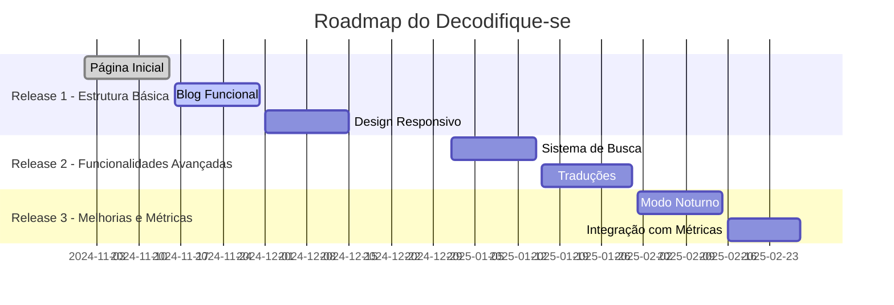
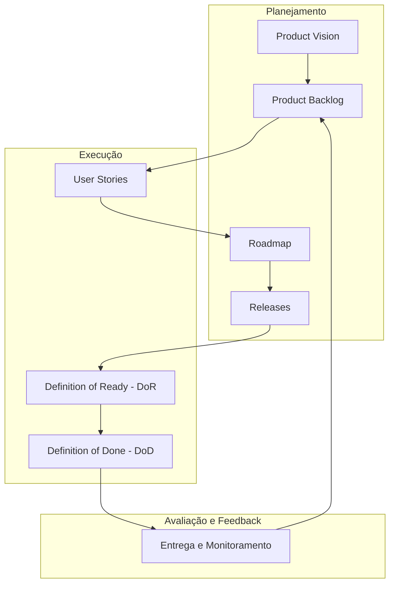

## Continuando a Jornada: Criando um Roadmap

No primeiro post, vimos como documentar o início de um projeto, abordando elementos essenciais como **Product Vision**, **Product Backlog Inicial**, **Definition of Ready (DoR)** e **Definition of Done (DoD)**. Agora, vamos avançar no processo e falar sobre o **Roadmap**, um instrumento fundamental para alinhar a equipe e estruturar o desenvolvimento do projeto.

---

### **O Que é um Roadmap?**

Um **Roadmap** é uma visão de alto nível que organiza e prioriza as entregas de um projeto ao longo do tempo. Ele conecta os objetivos estratégicos ao planejamento prático, garantindo que a equipe saiba o que será feito e em qual ordem.

---

### **Por Que Criar um Roadmap?**

O Roadmap ajuda a transformar ideias em um plano concreto, oferecendo:

- **Alinhamento Estratégico:** Define uma direção clara para todos os envolvidos.
- **Transparência:** Mantém as partes interessadas informadas sobre o progresso e as prioridades.
- **Flexibilidade:** Permite ajustes conforme o projeto evolui.
- **Foco:** Garante que os esforços sejam direcionados ao que realmente importa.

---

### **Construindo o Roadmap**

#### **1. Conecte o Roadmap ao Product Vision**

Relembre o objetivo e o público-alvo definidos no **Product Vision**. O Roadmap deve refletir como essas metas serão alcançadas em etapas claras e organizadas.

#### **2. Estruture o Roadmap com Releases**

Divida o desenvolvimento em **releases**. Cada release deve ter entregas tangíveis e estar alinhada às prioridades do backlog.

Exemplo:

- **Release 1:** Estrutura básica do site (home, blog, documentação).
- **Release 2:** Funcionalidades avançadas (busca, tradução).
- **Release 3:** Melhorias de design e análise de métricas.

#### **3. Priorize Funcionalidades**

Utilize o método **MoSCoW** (Must-Have, Should-Have, Could-Have, Won't-Have) para categorizar os itens do backlog e decidir o que entra em cada release.

Exemplo para a **Release 1**:

- **Must-Have:** Página inicial e blog funcional.
- **Should-Have:** Design responsivo.
- **Could-Have:** Modo noturno.
- **Won't-Have:** Sistema de comentários.

#### **4. Inclua Marcos e Prazos**

Defina marcos importantes para acompanhar o progresso e manter a equipe motivada.

Exemplo:

- **Março 2024:** Lançamento da versão inicial do site.
- **Junho 2024:** Adição de sistema de busca e tradução.

---

#### **5. Escolha uma Ferramenta para o Roadmap**

Escolha uma ferramenta que facilite a visualização e colaboração, como:

- Planilhas simples (Google Sheets).
- Ferramentas visuais (Trello, Miro).
- Funcionalidades integradas (GitHub Projects).

### **Exemplo Prático de Roadmap**

Aqui está um exemplo visual de Roadmap utilizando o **Mermaid**:

### **Dicas para Manter o Roadmap Relevante**

1. **Atualize Regularmente:** Revise o Roadmap em reuniões de planejamento para adaptá-lo às novas demandas.
2. **Seja Realista:** Defina metas alcançáveis e evite sobrecarregar as releases.
3. **Use Ferramentas Colaborativas:** Opte por ferramentas que facilitem a visualização e o alinhamento, como GitHub Projects, Trello ou Miro.

---

### Conectando ao Ciclo de Vida do Projeto

O Roadmap não é um documento isolado; ele está intimamente conectado às outras documentações do ciclo de vida do projeto, como o **Product Backlog** e o **DoD**. Ele serve como guia estratégico para garantir que todas as entregas estejam alinhadas ao objetivo do projeto.

#### Diagrama de relação:

## Conclusão

O Roadmap é mais do que um cronograma; é uma ferramenta estratégica para garantir que todos os envolvidos no projeto estejam alinhados. Ao estruturar as entregas em releases claras e priorizadas, você cria um caminho eficaz para transformar a visão do projeto em realidade.

Com as documentações essenciais em mãos, o próximo passo é definir como vamos organizar o trabalho: Scrum, Kanban, ou outro método? No próximo post, vamos explorar as Metodologias Ágeis mais utilizadas e como escolher a que melhor se adapta ao seu projeto.

Se você gostou deste post ou tem sugestões, deixe seu feedback nos comentários. Até a próxima! 🚀
